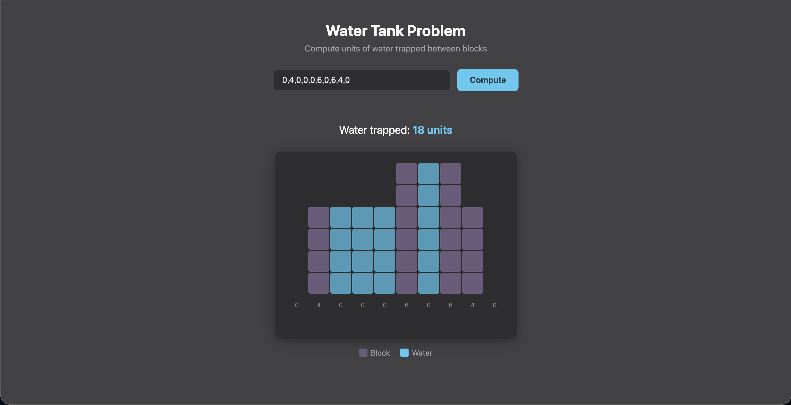

# Water Tank Problem

Given an array of non-negative integers representing block heights, compute the units of water that can be trapped between them.

## Example

**Input:** `[0, 4, 0, 0, 0, 6, 0, 6, 4, 0]`
**Output:** `18 units`

## Screenshot



## How to Run

Open `index.html` in any modern browser. No build tools or server required.

## Project Structure

```
├── index.html                 # Page markup
├── styles.css                 # Styling (CSS custom properties)
├── water-tank-algorithm.js    # Core algorithm (pure logic, no DOM)
├── app.js                     # DOM interaction, input parsing, SVG rendering
└── README.md
```

## Algorithm

Uses the **prefix-max / suffix-max** approach:

1. For each index, compute the maximum height to its left (`maxLeft[i]`).
2. For each index, compute the maximum height to its right (`maxRight[i]`).
3. Water at each index = `min(maxLeft[i], maxRight[i]) - height[i]`.

**Time complexity:** O(n)
**Space complexity:** O(n)

## Visualization

The app renders an SVG grid where:
- **Purple cells** represent blocks
- **Blue cells** represent trapped water

## AI Usage

AI (Claude) was used to assist with SVG generation for the visualization. The algorithm and application logic were written manually.
